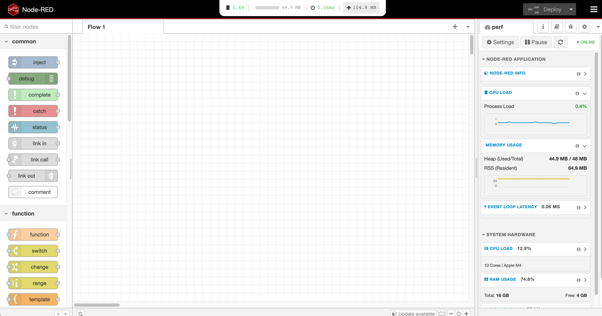
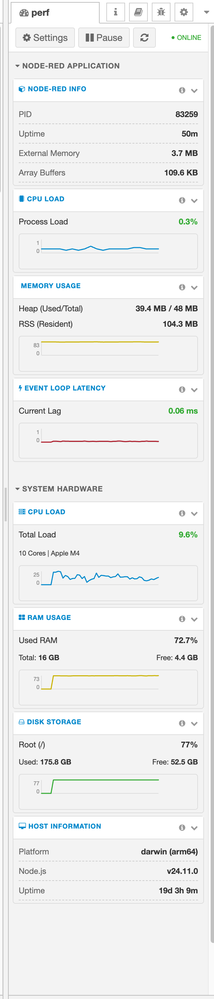
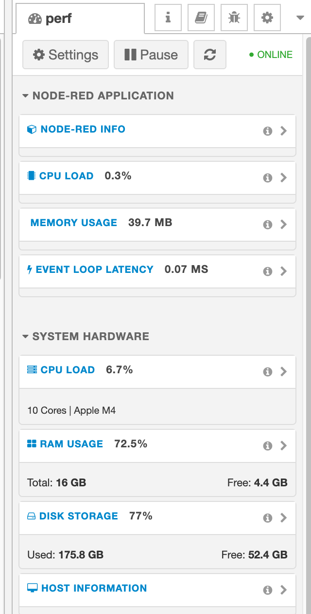

# Node-RED Performance Monitor



A powerful, native **Performance Monitor** sidebar for Node-RED. It provides real-time visibility into your Node-RED instance's health and system resources with a beautiful, integrated design.

**v1.1.0 - The Precision & UI Update**
- 🚀 **Zero Dependencies** (No binary compilation required)
- 🖥️ **Cross-Platform** (macOS, Windows, Linux, Alpine, Raspberry Pi)
- 🎨 **Component-Level Theming** (Matches your Node-RED theme)

---

## ✨ Features

### 🔍 Real-Time Monitoring
Monitor key metrics with sub-second precision:
- **CPU Load**: Diff-based process usage calculation.
- **Memory**: Detailed heap and RSS tracking to spot leaks.
- **Event Loop Lag**: Millisecond-level latency detection.
- **System Hardware**: Full system CPU, RAM, and Disk usage with live sparkline history.

### 📐 Smart Sidebar
The sidebar is designed for efficiency.

#### Expanded Mode
Detailed view with progress bars, precise values, and history charts.


#### Mini Mode
Collapse any section to save space. The **Live Value** stays visible in the header, and the **Chart** remains active.


---

## 🎨 Themes

Includes 4 stunning themes that layer on top of your Node-RED colors.

| **Classic** | **Funky** |
| :---: | :---: |
|  |  |
| *Seamless Integration* | *Vibrant & Playful* |

| **Matrix** | **Cyberpunk** |
| :---: | :---: |
|  |  |
| *Terminal Code Esthetic* | *Neon Future Style* |

---

## 📦 Installation

Run the following command in your Node-RED user directory (typically `~/.node-red`):

```bash
npm install node-red-contrib-performance-monitor
```

Restart Node-RED, and you will see a new **Dashboard** icon in the sidebar designated for Performance Monitoring.

---

## 🔧 Configuration

Access settings by clicking the **Settings** button in the sidebar toolbar.
- **Refresh Rate**: Adjust polling interval (default: 2s).
- **HUD Widget**: Toggle the top header widget visibility.
- **Theme Selection**: Choose your preferred visual style.

## 🤝 License
MIT
