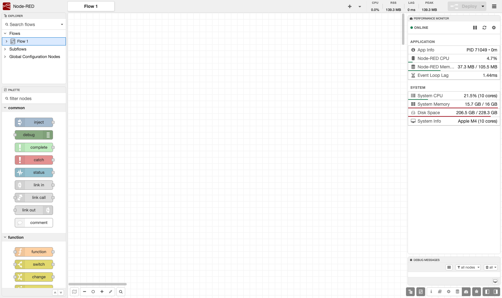
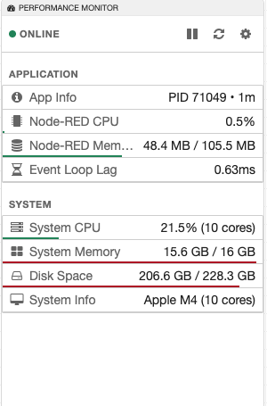
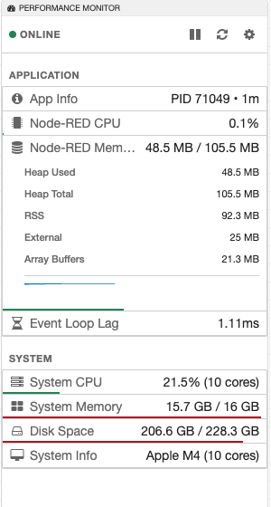
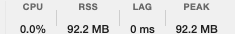

# Node-RED Performance Monitor

[](https://www.npmjs.com/package/node-red-contrib-performance-monitor)
[](LICENSE)
[](https://nodered.org)

A native **Performance Monitor** for Node-RED. It adds a compact sidebar and a header
HUD that show real-time process and system health, keeps queryable history in an
embedded database, and raises alarms on anomalies — all themed to blend into the
Node-RED editor (light **and** dark).



---

## ✨ Highlights

- **Compact sidebar** — every metric is a dense, single-line row; click any row to
  expand history and details. The whole monitor fits without scrolling.
- **Header HUD** — CPU, RSS, event-loop lag and session-peak memory, always visible
  in the editor header (toggleable).
- **Native theming** — inherits Node-RED's own CSS variables, so it follows the
  editor's light/dark theme automatically. No custom themes to configure.
- **Embedded history** — metrics are stored in SQLite via Node's built-in
  `node:sqlite` (no native build step), with configurable retention.
- **Flow node** — a `perf-monitor` node to read metrics inside your flows.
- **Anomaly detection** — built-in CPU/heap/loop/traffic patterns plus user-defined
  fixed and statistical alarm rules.
- **Historical report** — a full-screen dashboard of past metrics over HTTP.

| Sidebar | Expanded row | Header HUD |
| :---: | :---: | :---: |
|  |  |  |

---

## 🔍 What it monitors

- **Node-RED process** — CPU load, heap used/total, RSS, external & array-buffer
  memory, event-loop lag, PID, uptime.
- **System** — total CPU load (all cores), RAM usage, disk usage, CPU model/cores.
- **Containers** — detects cgroup v1/v2 limits (memory & CPU) and reports against the
  container's limits, not just the host's.

---

## 📦 Installation

From your Node-RED user directory (usually `~/.node-red`):

```bash
npm install node-red-contrib-performance-monitor
```

Restart Node-RED. A **Performance Monitor** tab appears in the sidebar, and the HUD
appears in the editor header.

---

## ✅ Compatibility

| | Supported |
| --- | --- |
| **Node-RED** | 4.x and **5.x** (built and verified for Node-RED 5) |
| **Node.js** | **≥ 22.9** (uses the built-in `node:sqlite` module) |
| **OS** | macOS, Windows, Linux, Alpine, Raspberry Pi |
| **Containers** | Docker / Kubernetes (cgroup v1 & v2 aware) |

> **No native dependencies.** History uses Node's built-in SQLite, so there is no
> `node-gyp`/compiler step — installs cleanly on Alpine, ARM and minimal container
> images, and upgrades don't break on Node version changes. If SQLite is unavailable
> on the host runtime, the plugin automatically falls back to in-memory history
> instead of failing to load.

---

## 🔧 Configuration

Click the **gear** in the sidebar toolbar:

| Setting | Default | Description |
| --- | --- | --- |
| Refresh interval | 2000 ms | Polling cadence (min 500 ms). |
| History retention | 7 days | How long to keep stored metrics. |
| Max DB size | 500 MB | Cap for the SQLite history database. |
| Hide header HUD | off | Toggle the editor-header widget. |

---

## 🌐 HTTP API

All routes are served under the Node-RED admin path:

| Method | Route | Purpose |
| --- | --- | --- |
| GET | `/performance-monitor/stats` | Current process + system snapshot |
| GET | `/performance-monitor/recent` | Recent samples |
| GET | `/performance-monitor/range` | Samples in a time range (optional bucketing) |
| GET | `/performance-monitor/summary` | min/max/avg/p95 over a window |
| GET | `/performance-monitor/stream` | Server-sent live sample stream |
| GET | `/performance-monitor/report` | Full-screen historical dashboard |
| GET/POST | `/performance-monitor/settings` | Read / update settings |
| GET/POST/PUT/DELETE | `/performance-monitor/alarm-rules` | Manage anomaly alarm rules |

---

## 🤝 License

MIT — see [LICENSE](LICENSE).

[](https://www.buymeacoffee.com/muratcanberber)
